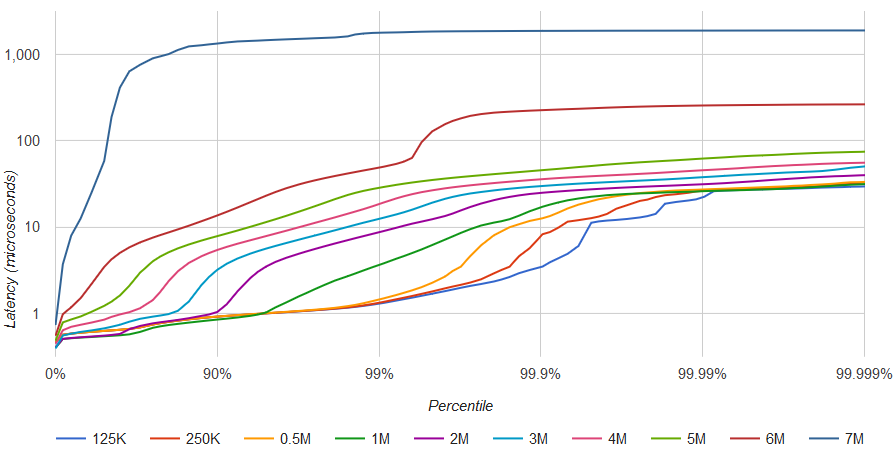

# exchange-core
[](https://travis-ci.org/mzheravin/exchange-core)
[](https://www.javadoc.io/doc/exchange.core2/exchange-core)
[](https://lgtm.com/projects/g/mzheravin/exchange-core/context:java)
[![][license img]][license]

Exchange-core is an **open source market exchange core** based on 
[LMAX Disruptor](https://github.com/LMAX-Exchange/disruptor), 
[Eclipse Collections](https://www.eclipse.org/collections/) (ex. Goldman Sachs GS Collections), 
[Real Logic Agrona](https://github.com/real-logic/agrona),
[OpenHFT Chronicle-Wire](https://github.com/OpenHFT/Chronicle-Wire),
[LZ4 Java](https://github.com/lz4/lz4-java),
and [Adaptive Radix Trees](https://db.in.tum.de/~leis/papers/ART.pdf).

Exchange-core includes:
- orders matching engine
- risk control and accounting module
- disk journaling and snapshots module
- trading, admin and reports API

Designed for high scalability and pauseless 24/7 operation under high-load conditions and providing low-latency responses:
- 3M users having 10M accounts in total
- 100K order books (symbols) having 4M pending orders in total
- less than 1ms worst wire-to-wire target latency for 1M+ operations per second throughput
- 150ns per matching for large market orders

Single order book configuration is capable to process 5M operations per second on 10-years old hardware (Intel® Xeon® X5690) with moderate latency degradation:

|rate|50.0%|90.0%|95.0%|99.0%|99.9%|99.99%|worst|
|----|-----|-----|-----|-----|-----|------|-----|
|125K|0.6µs|0.9µs|1.0µs|1.4µs|4µs  |24µs  |41µs |
|250K|0.6µs|0.9µs|1.0µs|1.4µs|9µs  |27µs  |41µs |
|500K|0.6µs|0.9µs|1.0µs|1.6µs|14µs |29µs  |42µs |
|  1M|0.5µs|0.9µs|1.2µs|4µs  |22µs |31µs  |45µs |
|  2M|0.5µs|1.2µs|3.9µs|10µs |30µs |39µs  |60µs |
|  3M|0.7µs|3.6µs|6.2µs|15µs |36µs |45µs  |60µs |
|  4M|1.0µs|6.0µs|9µs  |25µs |45µs |55µs  |70µs |
|  5M|1.5µs|9.5µs|16µs |42µs |150µs|170µs |190µs|
|  6M|5µs  |30µs |45µs |300µs|500µs|520µs |540µs|
|  7M|60µs |1.3ms|1.5ms|1.8ms|1.9ms|1.9ms |1.9ms|



Benchmark configuration:
- Single symbol order book.
- 3,000,000 inbound messages are distributed as follows: 9% GTC orders, 3% IOC orders, 6% cancel commands, 82% move commands. About 6% of all messages are triggering one or more trades.
- 1,000 active user accounts.
- In average ~1,000 limit orders are active, placed in ~750 different price slots.
- Latency results are only for risk processing and orders matching. Other stuff like network interface latency, IPC, journaling is not included.
- Test data is not bursty, meaning constant interval between commands (0.2~8µs depending on target throughput).
- BBO prices are not changing significantly throughout the test. No avalanche orders.
- No coordinated omission effect for latency benchmark. Any processing delay affects measurements for next following messages.
- GC is triggered prior/after running every benchmark cycle (3,000,000 messages).
- RHEL 7.5, network-latency tuned-adm profile, dual X5690 6 cores 3.47GHz, one socket isolated and tickless, spectre/meltdown protection disabled.
- Java version 8u192, newer Java 8 versions can have a [performance bug](https://bugs.java.com/bugdatabase/view_bug.do?bug_id=JDK-8221355)

### Features
- HFT optimized. Priority is a limit-order-move operation mean latency (currently ~0.5µs). Cancel operation takes ~0.7µs, placing new order ~1.0µs;
- In-memory working state for accounting data and order books.
- Event-sourcing - disk journaling and journal replay support, state snapshots (serialization) and restore operations, LZ4 compression.
- Lock-free and contention-free orders matching and risk control algorithms.
- No floating-point arithmetic, no loss of significance is possible.
- Matching engine and risk control operations are atomic and deterministic.
- Pipelined multi-core processing (based on LMAX Disruptor): each CPU core is responsible for certain processing stage, user accounts shard, or symbol order books shard.
- Two different risk processing modes (specified per symbol): direct-exchange and margin-trade.
- Maker/taker fees (defined in quote currency units).
- Two order books implementations: simple implementation ("Naive") and performance implementation ("Direct").
- Order types: Immediate-or-Cancel (IOC), Good-till-Cancel (GTC), Fill-or-Kill Budget (FOK-B)
- Testing - unit-tests, integration tests, stress tests, integrity/consistency tests.
- Low GC pressure, objects pooling, single ring-buffer.
- Threads affinity (requires JNA).
- User suspend/resume operation (reduces memory consumption).
- Core reports API (user balances, open interest).

### New Features

#### Caching
- High-performance caching using Caffeine
- Configurable cache sizes and expiration times
- Separate caches for orders and users
- Automatic cache statistics and monitoring

#### API Gateway
- Spring Cloud Gateway integration
- Route configuration for trading, admin, and reporting services
- Request/response transformation
- Rate limiting and circuit breaking support

#### Docker Support
- Multi-stage Docker build
- Optimized for production use
- Environment variable configuration
- Health check endpoints

#### Swagger/OpenAPI Documentation
- Interactive API documentation
- API versioning support
- Request/response examples
- Authentication documentation

#### Modern Java Features
- Java 21 support
- Lombok for reduced boilerplate
- Structured logging with SLF4J
- Comprehensive exception handling

### Installation
1. Install library into your Maven's local repository by running `mvn install`
2. Add the following Maven dependency to your project's `pom.xml`:
```
<dependency>
    <groupId>exchange.core2</groupId>
    <artifactId>exchange-core</artifactId>
    <version>0.5.0</version>
</dependency>
```

Alternatively, you can clone this repository and run the [example test](https://github.com/mzheravin/exchange-core/tree/master/src/test/java/exchange/core2/tests/examples/ITCoreExample.java).

### Usage examples
Create and start empty exchange core:
```java
// simple async events handler
SimpleEventsProcessor eventsProcessor = new SimpleEventsProcessor(new IEventsHandler() {
    @Override
    public void tradeEvent(TradeEvent tradeEvent) {
        System.out.println("Trade event: " + tradeEvent);
    }

    @Override
    public void reduceEvent(ReduceEvent reduceEvent) {
        System.out.println("Reduce event: " + reduceEvent);
    }

    @Override
    public void rejectEvent(RejectEvent rejectEvent) {
        System.out.println("Reject event: " + rejectEvent);
    }

    @Override
    public void commandResult(ApiCommandResult commandResult) {
        System.out.println("Command result: " + commandResult);
    }

    @Override
    public void orderBook(OrderBook orderBook) {
        System.out.println("OrderBook event: " + orderBook);
    }
});

// default exchange configuration
ExchangeConfiguration conf = ExchangeConfiguration.defaultBuilder().build();

// no serialization
Supplier<ISerializationProcessor> serializationProcessorFactory = () -> DummySerializationProcessor.INSTANCE;

// build exchange core
ExchangeCore exchangeCore = ExchangeCore.builder()
        .resultsConsumer(eventsProcessor)
        .serializationProcessorFactory(serializationProcessorFactory)
        .exchangeConfiguration(conf)
        .build();

// start up disruptor threads
exchangeCore.startup();

// get exchange API for publishing commands
ExchangeApi api = exchangeCore.getApi();
```

Create new symbol:
```java
// currency code constants
final int currencyCodeXbt = 11;
final int currencyCodeLtc = 15;

// symbol constants
final int symbolXbtLtc = 241;

// create symbol specification and publish it
CoreSymbolSpecification symbolSpecXbtLtc = CoreSymbolSpecification.builder()
        .symbolId(symbolXbtLtc)         // symbol id
        .type(SymbolType.CURRENCY_EXCHANGE_PAIR)
        .baseCurrency(currencyCodeXbt)    // base = satoshi (1E-8)
        .quoteCurrency(currencyCodeLtc)   // quote = litoshi (1E-8)
        .baseScaleK(1_000_000L) // 1 lot = 1M satoshi (0.01 BTC)
        .quoteScaleK(10_000L)   // 1 price step = 10K litoshi
        .takerFee(1900L)        // taker fee 1900 litoshi per 1 lot
        .makerFee(700L)         // maker fee 700 litoshi per 1 lot
        .build();

future = api.submitBinaryDataAsync(new BatchAddSymbolsCommand(symbolSpecXbtLtc));
```

Create new users:
```java
// create user uid=301
future = api.submitCommandAsync(ApiAddUser.builder()
        .uid(301L)
        .build());

// create user uid=302
future = api.submitCommandAsync(ApiAddUser.builder()
        .uid(302L)
        .build());
```

Perform deposits:
```java
// first user deposits 20 LTC
future = api.submitCommandAsync(ApiAdjustUserBalance.builder()
        .uid(301L)
        .currency(currencyCodeLtc)
        .amount(2_000_000_000L)
        .transactionId(1L)
        .build());

// second user deposits 0.10 BTC
future = api.submitCommandAsync(ApiAdjustUserBalance.builder()
        .uid(302L)
        .currency(currencyCodeXbt)
        .amount(10_000_000L)
        .transactionId(2L)
        .build());
```

Place orders:
```java
// first user places Good-till-Cancel Bid order
// he assumes BTCLTC exchange rate 154 LTC for 1 BTC
// bid price for 1 lot (0.01BTC) is 1.54 LTC => 1_5400_0000 litoshi => 10K * 15_400 (in price steps)
future = api.submitCommandAsync(ApiPlaceOrder.builder()
        .uid(301L)
        .orderId(5001L)
        .price(15_400L)
        .reservePrice(15_600L) // can move bid order up to the 1.56 LTC, without replacing it
        .size(12L) // order size is 12 lots
        .action(OrderAction.BID)
        .orderType(OrderType.GTC) // Good-till-Cancel
        .symbol(symbolXbtLtc)
        .build());

// second user places Immediate-or-Cancel Ask (Sell) order
// he assumes wost rate to sell 152.5 LTC for 1 BTC
future = api.submitCommandAsync(ApiPlaceOrder.builder()
        .uid(302L)
        .orderId(5002L)
        .price(15_250L)
        .size(10L) // order size is 10 lots
        .action(OrderAction.ASK)
        .orderType(OrderType.IOC) // Immediate-or-Cancel
        .symbol(symbolXbtLtc)
        .build());
```

Request order book:
```java
future = api.requestOrderBookAsync(symbolXbtLtc, 10);
```

GtC orders manipulations:
```java
// first user moves remaining order to price 1.53 LTC
future = api.submitCommandAsync(ApiMoveOrder.builder()
        .uid(301L)
        .orderId(5001L)
        .newPrice(15_300L)
        .symbol(symbolXbtLtc)
        .build());
        
// first user cancel remaining order
future = api.submitCommandAsync(ApiCancelOrder.builder()
        .uid(301L)
        .orderId(5001L)
        .symbol(symbolXbtLtc)
        .build());
```

Check user balance and GtC orders:
```java
Future<SingleUserReportResult> report = api.processReport(new SingleUserReportQuery(301), 0);
```

Check system balance:
```java
// check fees collected
Future<TotalCurrencyBalanceReportResult> totalsReport = api.processReport(new TotalCurrencyBalanceReportQuery(), 0);
System.out.println("LTC fees collected: " + totalsReport.get().getFees().get(currencyCodeLtc));
```

### Testing

- **Unit Tests**: Cover all core logic, AWS DynamoDB integration, and utility classes. Located in `src/test/java` mirroring the main package structure.
- **Integrity/Integration Tests**: Validate system consistency, order matching, persistence, and recovery. Found in `src/test/java/exchange/core2/tests/integration` and related directories.

### Running Tests

Run all tests with:

```sh
mvn clean test
```

This will execute both unit and integrity tests, including DynamoDB integration (requires a local or test DynamoDB endpoint for AWS tests).

### TODOs
- market data feeds (full order log, L2 market data, BBO, trades)
- clearing and settlement
- reporting
- clustering
- FIX and REST API gateways
- cryptocurrency payment gateway
- more tests and benchmarks
- NUMA-aware and CPU layout custom configuration

### Contributing
Exchange-core is an open-source project and contributions are welcome!

### Support
- [Discussion group in Telegram (t.me/exchangecoretalks)](https://t.me/exchangecoretalks)
- [News channel in Telegram (t.me/exchangecore)](https://t.me/exchangecore)

## Requirements
- Java 21 or newer
- Maven 3.6+

### AWS DynamoDB Support

Exchange-core now supports AWS DynamoDB for persistence. To enable and use DynamoDB:

1. Ensure you have AWS credentials configured (via environment variables, AWS CLI, or IAM roles).
2. The project uses the AWS SDK v2 for DynamoDB. You can configure the region and endpoint in `ExchangeDynamoDBConfig`.
3. Example usage:

```java
import exchange.core2.core.aws.DynamoDBConfig;
import exchange.core2.core.aws.ExchangeDynamoDBService;

DynamoDBConfig dynamoDBConfig = new DynamoDBConfig("us-east-1");
ExchangeDynamoDBService dynamoDBService = new ExchangeDynamoDBService(dynamoDBConfig);
// Use dynamoDBService to save and retrieve orders/users
```

4. DynamoDB tables (`exchange_orders`, `exchange_users`) are created automatically if they do not exist.

### Java Version

This project now requires **Java 21** or newer. Please ensure your `JAVA_HOME` and build environment are set accordingly.

## Security Best Practices

- **Java & Maven**
  - Always use the latest LTS version of Java (Java 21+) and keep dependencies up to date.
  - Use Maven plugins like `maven-enforcer-plugin` and `dependency-check-maven` to prevent vulnerable or outdated dependencies.
  - Avoid using deprecated or insecure libraries.

- **AWS DynamoDB**
  - Use IAM roles with least privilege for any AWS access.
  - Never hardcode AWS credentials; use environment variables or IAM roles.
  - Enable AWS CloudTrail and DynamoDB encryption at rest.
  - Regularly audit IAM permissions and DynamoDB access logs.

- **Code Security**
  - Validate all user and API inputs.
  - Never log sensitive data (such as credentials, private keys, or personal information).
  - Use secure random number generators for any cryptographic or sensitive operations.
  - Keep third-party dependencies updated to avoid known vulnerabilities.

- **General**
  - Review and test for common vulnerabilities (OWASP Top 10).
  - Use static code analysis tools and enable compiler warnings.
  - Regularly review and update security policies and dependencies.

### Running with Docker

1. Build the Docker image:
```bash
docker build -t exchange-core .
```

2. Run the container:
```bash
docker run -p 8080:8080 \
  -e DYNAMODB_ENDPOINT=http://localhost:8000 \
  -e AWS_REGION=us-east-1 \
  exchange-core
```

### API Documentation

Access the Swagger UI at:
```
http://localhost:8080/swagger-ui.html
```

### Configuration

The application can be configured through environment variables or the `application.yml` file:

```yaml
server:
  port: 8080

spring:
  application:
    name: exchange-core

caffeine:
  cache:
    orders:
      expire-after-write: 10m
      maximum-size: 10000

aws:
  dynamodb:
    region: us-east-1
    endpoint: ${DYNAMODB_ENDPOINT:}
```

[license]:LICENSE.txt
[license img]:https://img.shields.io/badge/License-Apache%202-blue.svg

## Trading Service

The trading service is a Spring Boot microservice that provides REST APIs for managing trading orders and operations.

### Features

- RESTful API for order management
- Redis caching for improved performance
- Swagger documentation
- Docker support
- Global exception handling
- Input validation

### Prerequisites

- Java 21
- Maven
- Docker and Docker Compose
- Redis

### Running the Service

#### Using Docker Compose

1. Build and start the services:
```bash
docker-compose up --build
```

2. Access the Swagger documentation:
```
http://localhost:8081/swagger-ui.html
```

#### Running Locally

1. Start Redis:
```bash
docker-compose up redis
```

2. Build the project:
```bash
mvn clean install
```

3. Run the trading service:
```bash
mvn spring-boot:run -pl trading-service
```

### API Endpoints

- `POST /api/v1/orders` - Place a new order
- `GET /api/v1/orders/{orderId}` - Get order details
- `DELETE /api/v1/orders/{orderId}` - Cancel an order
- `GET /api/v1/orders/symbol/{symbolId}` - Get orders by symbol
- `GET /api/v1/orders/user/{userId}` - Get orders by user

### Configuration

The service can be configured using the following environment variables:

- `SPRING_PROFILES_ACTIVE` - Active Spring profile (default: dev)
- `SPRING_REDIS_HOST` - Redis host (default: localhost)
- `SPRING_REDIS_PORT` - Redis port (default: 6379)

### Development

#### Project Structure

```
trading-service/
├── src/
│   ├── main/
│   │   ├── java/
│   │   │   └── exchange/
│   │   │       └── core2/
│   │   │           └── trading/
│   │   │               ├── config/
│   │   │               ├── controller/
│   │   │               ├── dto/
│   │   │               ├── exception/
│   │   │               └── service/
│   │   └── resources/
│   │       └── application.yml
│   └── test/
└── pom.xml
```

#### Adding New Features

1. Create DTOs for request/response
2. Add service interface and implementation
3. Create controller endpoints
4. Add exception handling if needed
5. Update Swagger documentation
6. Add unit tests

### Testing

Run the tests using Maven:

```bash
mvn test -pl trading-service
```

### Security Best Practices

1. Input Validation
   - All input is validated using Bean Validation
   - Custom validation for business rules

2. Error Handling
   - Global exception handler
   - Proper error messages
   - No sensitive information in responses

3. API Security
   - Rate limiting (to be implemented)
   - Request validation
   - Proper HTTP status codes

4. Data Security
   - Redis security configuration
   - No sensitive data in logs
   - Proper error handling

### Contributing

1. Fork the repository
2. Create a feature branch
3. Commit your changes
4. Push to the branch
5. Create a Pull Request

### License

This project is licensed under the Apache License 2.0 - see the LICENSE file for details.
